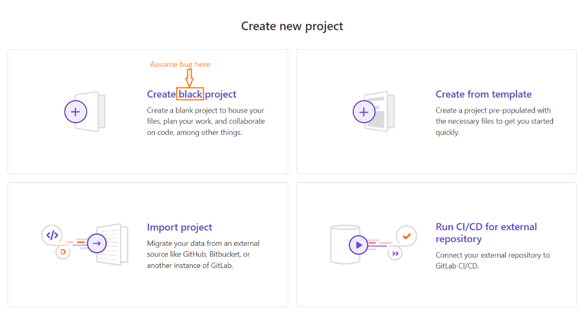

## Summary (Summarize the bug encountered concisely)

On the Project Creation page, the label text reads **"Create black project"** instead of **"Create blank project"**. This is a typographical error that may confuse users when creating a new project.

## Steps to reproduce

1. Log in to GitLab.
2. Go to **Projects** and then to **New Project**.
3. Look under the section where you can create a **blank project**.
4. Observe the button or label text displayed.

## What is the current bug behavior?

The button text says **"Create black project"**.

## What is the expected correct behavior?

The text should correctly say **"Create blank project"**.

## Relevant logs and/or screenshots

If you open `https://gitlab.com/projects/new#blank_project`, #I put a link to real gitlab page
you will see the incorrect text on the project creation option.  
The scrinshot

## Possible fixes

Correct the typo in the front-end text file.  
Replace `"Create black project"` with `"Create blank project"` in the project creation view or language file.

## Whom do you report/ Assign To/ Tags

/label ~bug ~typo ~ui  
/cc @project-manager  
/assign @qa-tester

## Priority

**Minor**

This issue does not affect functionality, but it impacts user interface clarity and may confuse users during project creation.
